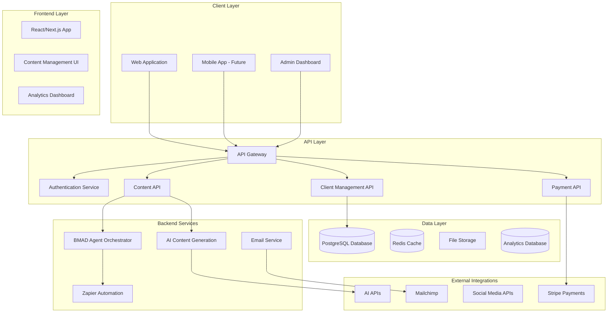

# Proposed Fullstack Architecture

## High-Level Architecture



## Technology Stack Recommendation

| Category | Technology | Version | Purpose | Rationale |
|----------|------------|---------|---------|-----------|
| **Frontend** | Next.js | 14.x | Full-stack React framework | SEO optimization, server-side rendering for content |
| **UI Framework** | Tailwind CSS | 3.x | Styling and components | Rapid development, consistent design system |
| **State Management** | Zustand | 4.x | Client state management | Lightweight, simple API for trauma-healing app |
| **Backend** | Node.js | 18.x | Runtime environment | JavaScript ecosystem consistency |
| **API Framework** | Express.js | 4.x | REST API server | Mature, extensive middleware ecosystem |
| **Database** | PostgreSQL | 15.x | Primary database | ACID compliance, JSON support for flexible content |
| **Cache** | Redis | 7.x | Session and data caching | High performance, pub/sub for real-time features |
| **Authentication** | NextAuth.js | 4.x | Auth provider | Social login, session management |
| **File Storage** | AWS S3 | Latest | Media and document storage | Scalable, cost-effective |
| **Payment** | Stripe | Latest | Payment processing | Comprehensive API, webhook support |
| **Email** | Resend | Latest | Transactional emails | Developer-friendly, high deliverability |
| **Monitoring** | Sentry | Latest | Error tracking | Real-time error monitoring |
| **Analytics** | PostHog | Latest | User analytics | Privacy-focused, feature flags |
| **Deployment** | Vercel | Latest | Hosting platform | Next.js optimization, edge functions |

## Data Models

### 1. User Model
```typescript
interface User {
  id: string;
  email: string;
  name: string;
  role: 'client' | 'admin' | 'therapist';
  profile: {
    avatar?: string;
    bio?: string;
    traumaHistory?: string;
    goals?: string[];
  };
  preferences: {
    communicationStyle: 'gentle' | 'direct' | 'supportive';
    sessionFrequency: 'weekly' | 'biweekly' | 'monthly';
    notificationSettings: NotificationSettings;
  };
  createdAt: Date;
  updatedAt: Date;
}
```

### 2. Content Model
```typescript
interface Content {
  id: string;
  type: 'prompt' | 'template' | 'article' | 'meditation' | 'exercise';
  title: string;
  description: string;
  content: string;
  tags: string[];
  traumaType: TraumaType[];
  difficulty: 'beginner' | 'intermediate' | 'advanced';
  duration: number; // minutes
  author: string;
  version: string;
  status: 'draft' | 'review' | 'published' | 'archived';
  metadata: {
    aiGenerated: boolean;
    humanizationScore: number;
    effectivenessRating: number;
    usageCount: number;
  };
  createdAt: Date;
  updatedAt: Date;
}
```

### 3. Session Model
```typescript
interface Session {
  id: string;
  userId: string;
  contentId: string;
  type: 'prompt' | 'meditation' | 'exercise' | 'assessment';
  status: 'started' | 'completed' | 'paused';
  progress: {
    currentStep: number;
    totalSteps: number;
    timeSpent: number;
    responses: SessionResponse[];
  };
  outcomes: {
    emotionalState: EmotionalState;
    insights: string[];
    nextSteps: string[];
  };
  startedAt: Date;
  completedAt?: Date;
}
```

### 4. Assessment Model
```typescript
interface Assessment {
  id: string;
  userId: string;
  type: 'trauma-screening' | 'progress-check' | 'wellness-check';
  questions: AssessmentQuestion[];
  responses: AssessmentResponse[];
  score: number;
  recommendations: string[];
  completedAt: Date;
}
```

## API Specification

### REST API Endpoints

```yaml
openapi: 3.0.0
info:
  title: Trauma Healing API
  version: 1.0.0
  description: API for trauma healing personal brand business

servers:
  - url: https://api.traumahealing.com
    description: Production server

paths:
  /auth:
    post:
      summary: Authenticate user
      requestBody:
        content:
          application/json:
            schema:
              type: object
              properties:
                email:
                  type: string
                password:
                  type: string
      responses:
        '200':
          description: Authentication successful
          content:
            application/json:
              schema:
                $ref: '#/components/schemas/AuthResponse'

  /content:
    get:
      summary: Get content library
      parameters:
        - name: type
          in: query
          schema:
            type: string
        - name: traumaType
          in: query
          schema:
            type: string
        - name: difficulty
          in: query
          schema:
            type: string
      responses:
        '200':
          description: Content list
          content:
            application/json:
              schema:
                type: array
                items:
                  $ref: '#/components/schemas/Content'

  /sessions:
    post:
      summary: Start new session
      requestBody:
        content:
          application/json:
            schema:
              $ref: '#/components/schemas/SessionRequest'
      responses:
        '201':
          description: Session created
          content:
            application/json:
              schema:
                $ref: '#/components/schemas/Session'

  /assessments:
    post:
      summary: Complete assessment
      requestBody:
        content:
          application/json:
            schema:
              $ref: '#/components/schemas/AssessmentRequest'
      responses:
        '201':
          description: Assessment completed
          content:
            application/json:
              schema:
                $ref: '#/components/schemas/Assessment'
```

## Repository Structure

```
trauma-healing-business/
├── apps/
│   ├── web/                    # Next.js frontend application
│   │   ├── components/         # React components
│   │   ├── pages/             # Next.js pages
│   │   ├── hooks/             # Custom React hooks
│   │   ├── styles/            # Tailwind CSS styles
│   │   └── utils/             # Frontend utilities
│   ├── admin/                 # Admin dashboard
│   └── api/                   # Express.js API server
├── packages/
│   ├── shared/                # Shared TypeScript types
│   ├── ui/                    # Reusable UI components
│   └── utils/                 # Shared utilities
├── services/
│   ├── bmad-agents/           # BMAD agent configurations
│   ├── content-generation/    # AI content generation
│   ├── email-service/         # Email automation
│   └── analytics/             # Analytics service
├── infrastructure/
│   ├── terraform/             # Infrastructure as code
│   ├── docker/                # Docker configurations
│   └── scripts/               # Deployment scripts
├── docs/
│   ├── architecture.md        # This document
│   ├── api-docs.md           # API documentation
│   └── deployment.md         # Deployment guide
└── tools/
    ├── content-generator/     # Content generation tools
    ├── migration-scripts/     # Database migrations
    └── testing/              # Test utilities
```
