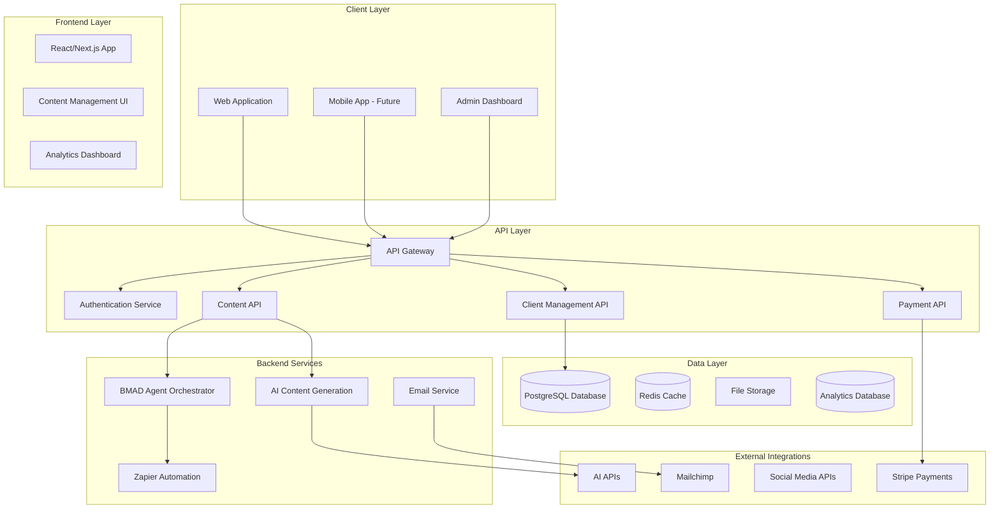

# Trauma Healing Personal Brand Business - Architecture Audit & Design

## Executive Summary

This document provides a comprehensive audit of the current project architecture and proposes a unified fullstack architecture for the trauma-healing personal brand business. The analysis covers existing components, identifies gaps, and provides a roadmap for implementation.

## Current Project Analysis

### Existing Infrastructure

#### 1. BMAD-METHOD Framework
- **Status**: ✅ Installed and configured
- **Components**: Core agents, creator tools, infrastructure-devops
- **Location**: `.bmad-core/`, `.bmad-creator-tools/`, `.bmad-infrastructure-devops/`
- **Agents Available**:
  - Trauma Healing Specialist (Aletheia)
  - Business Strategist (Kairos) 
  - SEO & Social Media Automation Specialist (Eidolon)
  - AI Copy Humanizer
  - Architect, PM, Analyst, Dev, QA, UX Expert

#### 2. Affiliate SEO Automation System
- **Status**: ✅ Partially implemented
- **Location**: `zapier-platform-schema/examples/affiliate-seo-automation/`
- **Components**:
  - Content generator (`src/generators/content-generator.js`)
  - Social scheduler (`src/automation/social-scheduler.js`)
  - Blog builder (`src/builders/blog-builder.js`)
  - Configuration system (`src/config/config.js`)

#### 3. Content Assets & Templates
- **Status**: ✅ Extensive library available
- **Categories**:
  - Trauma healing prompts and templates
  - Fiverr gig materials
  - Social media content
  - AI copywriting samples
  - Inner child healing resources

#### 4. Zapier Integration Framework
- **Status**: ✅ Schema defined
- **Capabilities**: Platform integration, automation workflows
- **Location**: `zapier-platform-schema/`

### Architecture Gaps Identified

#### 1. **Frontend Application**
- ❌ No web application for content management
- ❌ No user interface for trauma-healing services
- ❌ No client portal or booking system

#### 2. **Backend Services**
- ❌ No API server for content management
- ❌ No database for storing client data
- ❌ No authentication system
- ❌ No payment processing integration

#### 3. **Content Management System**
- ❌ No centralized content repository
- ❌ No version control for healing prompts
- ❌ No content approval workflow

#### 4. **Client Management**
- ❌ No CRM system
- ❌ No session tracking
- ❌ No progress monitoring

## Proposed Fullstack Architecture

### High-Level Architecture



### Technology Stack Recommendation

| Category | Technology | Version | Purpose | Rationale |
|----------|------------|---------|---------|-----------|
| **Frontend** | Next.js | 14.x | Full-stack React framework | SEO optimization, server-side rendering for content |
| **UI Framework** | Tailwind CSS | 3.x | Styling and components | Rapid development, consistent design system |
| **State Management** | Zustand | 4.x | Client state management | Lightweight, simple API for trauma-healing app |
| **Backend** | Node.js | 18.x | Runtime environment | JavaScript ecosystem consistency |
| **API Framework** | Express.js | 4.x | REST API server | Mature, extensive middleware ecosystem |
| **Database** | PostgreSQL | 15.x | Primary database | ACID compliance, JSON support for flexible content |
| **Cache** | Redis | 7.x | Session and data caching | High performance, pub/sub for real-time features |
| **Authentication** | NextAuth.js | 4.x | Auth provider | Social login, session management |
| **File Storage** | AWS S3 | Latest | Media and document storage | Scalable, cost-effective |
| **Payment** | Stripe | Latest | Payment processing | Comprehensive API, webhook support |
| **Email** | Resend | Latest | Transactional emails | Developer-friendly, high deliverability |
| **Monitoring** | Sentry | Latest | Error tracking | Real-time error monitoring |
| **Analytics** | PostHog | Latest | User analytics | Privacy-focused, feature flags |
| **Deployment** | Vercel | Latest | Hosting platform | Next.js optimization, edge functions |

### Data Models

#### 1. User Model
```typescript
interface User {
  id: string;
  email: string;
  name: string;
  role: 'client' | 'admin' | 'therapist';
  profile: {
    avatar?: string;
    bio?: string;
    traumaHistory?: string;
    goals?: string[];
  };
  preferences: {
    communicationStyle: 'gentle' | 'direct' | 'supportive';
    sessionFrequency: 'weekly' | 'biweekly' | 'monthly';
    notificationSettings: NotificationSettings;
  };
  createdAt: Date;
  updatedAt: Date;
}
```

#### 2. Content Model
```typescript
interface Content {
  id: string;
  type: 'prompt' | 'template' | 'article' | 'meditation' | 'exercise';
  title: string;
  description: string;
  content: string;
  tags: string[];
  traumaType: TraumaType[];
  difficulty: 'beginner' | 'intermediate' | 'advanced';
  duration: number; // minutes
  author: string;
  version: string;
  status: 'draft' | 'review' | 'published' | 'archived';
  metadata: {
    aiGenerated: boolean;
    humanizationScore: number;
    effectivenessRating: number;
    usageCount: number;
  };
  createdAt: Date;
  updatedAt: Date;
}
```

#### 3. Session Model
```typescript
interface Session {
  id: string;
  userId: string;
  contentId: string;
  type: 'prompt' | 'meditation' | 'exercise' | 'assessment';
  status: 'started' | 'completed' | 'paused';
  progress: {
    currentStep: number;
    totalSteps: number;
    timeSpent: number;
    responses: SessionResponse[];
  };
  outcomes: {
    emotionalState: EmotionalState;
    insights: string[];
    nextSteps: string[];
  };
  startedAt: Date;
  completedAt?: Date;
}
```

#### 4. Assessment Model
```typescript
interface Assessment {
  id: string;
  userId: string;
  type: 'trauma-screening' | 'progress-check' | 'wellness-check';
  questions: AssessmentQuestion[];
  responses: AssessmentResponse[];
  score: number;
  recommendations: string[];
  completedAt: Date;
}
```

### API Specification

#### REST API Endpoints

```yaml
openapi: 3.0.0
info:
  title: Trauma Healing API
  version: 1.0.0
  description: API for trauma healing personal brand business

servers:
  - url: https://api.traumahealing.com
    description: Production server

paths:
  /auth:
    post:
      summary: Authenticate user
      requestBody:
        content:
          application/json:
            schema:
              type: object
              properties:
                email:
                  type: string
                password:
                  type: string
      responses:
        '200':
          description: Authentication successful
          content:
            application/json:
              schema:
                $ref: '#/components/schemas/AuthResponse'

  /content:
    get:
      summary: Get content library
      parameters:
        - name: type
          in: query
          schema:
            type: string
        - name: traumaType
          in: query
          schema:
            type: string
        - name: difficulty
          in: query
          schema:
            type: string
      responses:
        '200':
          description: Content list
          content:
            application/json:
              schema:
                type: array
                items:
                  $ref: '#/components/schemas/Content'

  /sessions:
    post:
      summary: Start new session
      requestBody:
        content:
          application/json:
            schema:
              $ref: '#/components/schemas/SessionRequest'
      responses:
        '201':
          description: Session created
          content:
            application/json:
              schema:
                $ref: '#/components/schemas/Session'

  /assessments:
    post:
      summary: Complete assessment
      requestBody:
        content:
          application/json:
            schema:
              $ref: '#/components/schemas/AssessmentRequest'
      responses:
        '201':
          description: Assessment completed
          content:
            application/json:
              schema:
                $ref: '#/components/schemas/Assessment'
```

### Repository Structure

```
trauma-healing-business/
├── apps/
│   ├── web/                    # Next.js frontend application
│   │   ├── components/         # React components
│   │   ├── pages/             # Next.js pages
│   │   ├── hooks/             # Custom React hooks
│   │   ├── styles/            # Tailwind CSS styles
│   │   └── utils/             # Frontend utilities
│   ├── admin/                 # Admin dashboard
│   └── api/                   # Express.js API server
├── packages/
│   ├── shared/                # Shared TypeScript types
│   ├── ui/                    # Reusable UI components
│   └── utils/                 # Shared utilities
├── services/
│   ├── bmad-agents/           # BMAD agent configurations
│   ├── content-generation/    # AI content generation
│   ├── email-service/         # Email automation
│   └── analytics/             # Analytics service
├── infrastructure/
│   ├── terraform/             # Infrastructure as code
│   ├── docker/                # Docker configurations
│   └── scripts/               # Deployment scripts
├── docs/
│   ├── architecture.md        # This document
│   ├── api-docs.md           # API documentation
│   └── deployment.md         # Deployment guide
└── tools/
    ├── content-generator/     # Content generation tools
    ├── migration-scripts/     # Database migrations
    └── testing/              # Test utilities
```

## Implementation Roadmap

### Phase 1: Foundation (Weeks 1-2)
1. **Setup Development Environment**
   - Initialize Next.js project with TypeScript
   - Configure Tailwind CSS and UI components
   - Setup PostgreSQL database
   - Configure authentication with NextAuth.js

2. **Core Data Models**
   - Implement database schema
   - Create API endpoints for basic CRUD operations
   - Setup data validation and error handling

3. **Basic Frontend**
   - Landing page with trauma-healing focus
   - User authentication flows
   - Basic content browsing interface

### Phase 2: Content Management (Weeks 3-4)
1. **Content System**
   - Content creation and editing interface
   - Version control for healing prompts
   - Content approval workflow
   - Integration with BMAD agents for content generation

2. **User Experience**
   - Personalized content recommendations
   - Progress tracking dashboard
   - Session management interface

### Phase 3: Advanced Features (Weeks 5-6)
1. **AI Integration**
   - BMAD agent orchestration
   - AI-powered content personalization
   - Automated assessment scoring

2. **Analytics & Optimization**
   - User behavior tracking
   - Content effectiveness metrics
   - A/B testing framework

### Phase 4: Monetization (Weeks 7-8)
1. **Payment Integration**
   - Stripe payment processing
   - Subscription management
   - Fiverr gig automation

2. **Marketing Automation**
   - Email marketing integration
   - Social media automation
   - Affiliate tracking system

## Security Considerations

### Authentication & Authorization
- JWT-based authentication with refresh tokens
- Role-based access control (client, admin, therapist)
- Session management with Redis
- Rate limiting on API endpoints

### Data Protection
- End-to-end encryption for sensitive content
- GDPR compliance for user data
- Regular security audits
- Secure file upload handling

### Privacy
- Anonymous analytics where possible
- User consent management
- Data retention policies
- Secure deletion procedures

## Performance Optimization

### Frontend
- Next.js static generation for content pages
- Image optimization and lazy loading
- Code splitting and dynamic imports
- Service worker for offline functionality

### Backend
- Database query optimization
- Redis caching for frequently accessed data
- CDN for static assets
- API response compression

### Monitoring
- Real-time error tracking with Sentry
- Performance monitoring with PostHog
- Database query monitoring
- Uptime monitoring

## Scalability Considerations

### Horizontal Scaling
- Stateless API design
- Database read replicas
- Load balancing with multiple API instances
- CDN for global content delivery

### Vertical Scaling
- Database connection pooling
- Memory optimization
- Efficient caching strategies
- Background job processing

## Cost Optimization

### Infrastructure
- Serverless functions for low-traffic features
- Reserved instances for predictable workloads
- Auto-scaling based on demand
- Cost monitoring and alerts

### Development
- Reusable components and libraries
- Automated testing to reduce bugs
- Documentation for faster onboarding
- Code review processes

## Risk Assessment

### Technical Risks
- **AI Content Quality**: Implement human review processes
- **Data Security**: Regular security audits and compliance checks
- **Performance**: Monitor and optimize based on usage patterns
- **Integration Complexity**: Phased implementation approach

### Business Risks
- **Market Competition**: Focus on unique trauma-healing approach
- **Regulatory Changes**: Stay informed about mental health regulations
- **User Adoption**: Iterative development based on feedback
- **Revenue Model**: Diversify income streams

## Success Metrics

### Technical Metrics
- Page load times < 2 seconds
- API response times < 200ms
- 99.9% uptime
- Zero critical security vulnerabilities

### Business Metrics
- User engagement (sessions per user)
- Content completion rates
- User retention (30-day, 90-day)
- Revenue growth and conversion rates

### User Experience Metrics
- User satisfaction scores
- Feature adoption rates
- Support ticket volume
- User feedback sentiment

## Conclusion

This architecture provides a solid foundation for building a scalable, secure, and user-friendly trauma-healing personal brand business. The phased implementation approach allows for iterative development and validation of features before full deployment.

The integration with existing BMAD agents and content assets provides immediate value while the new fullstack application enables growth and scalability. The focus on user privacy, security, and performance ensures a trustworthy platform for sensitive mental health content.

**Next Steps:**
1. Review and approve this architecture
2. Begin Phase 1 implementation
3. Set up development environment
4. Create initial project structure
5. Implement core data models and API endpoints 